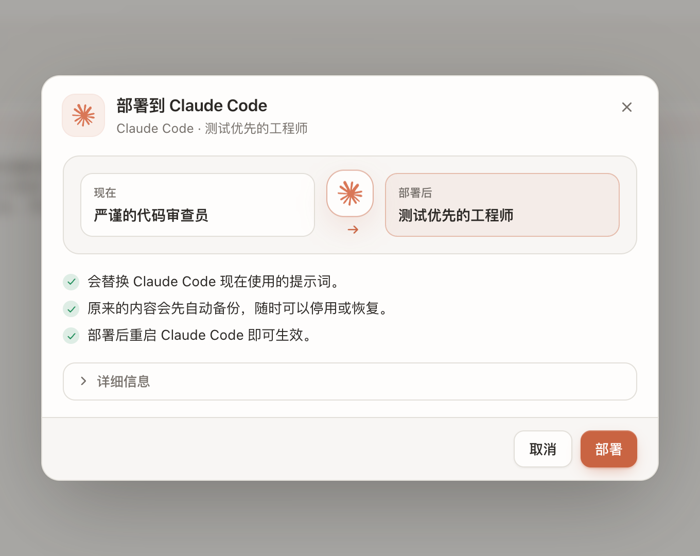
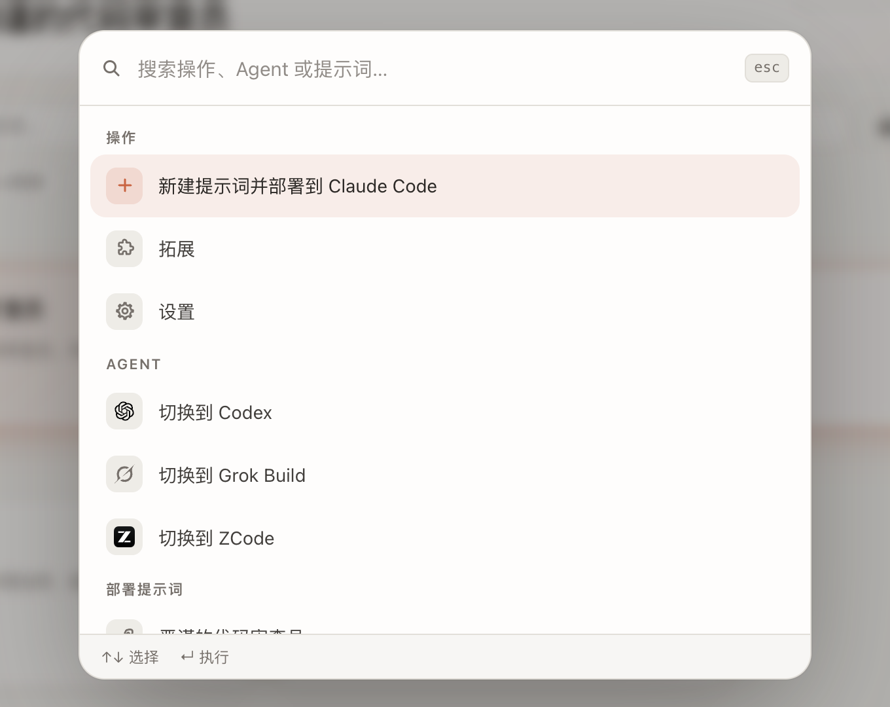

<div align="center">


# Keysmith Switch

**一个桌面 App，管好你所有 AI 编程 Agent 的提示词。**

粘贴提示词 → 先看部署计划 → 确认后部署到 **Claude Code** · **Codex** · **Grok Build** · **ZCode**

[](https://github.com/Jia-Ethan/keysmith-switch-releases/releases/latest)
[](#-下载)
[](https://tauri.app)
[](LICENSE)

[**下载**](#-下载) · [**功能**](#-功能) · [**工作原理**](#-工作原理) · [**拓展包**](#-拓展包) · [**开发**](#-开发) · [**反馈**](#-反馈)

<br />

<picture>
  <source media="(prefers-color-scheme: dark)" srcset="docs/images/main-dark.png" />
  
</picture>

</div>

<br />

## ✨ 功能

<table>
<tr>
<td width="50%" valign="top">

### 🗂️ 一个库，四个 Agent
所有提示词集中在一处，按 Agent 分开管理，带标签、搜索、排序和版本历史。左侧一键切换 Agent。

</td>
<td width="50%" valign="top">

### 🔍 部署前先看计划
每次部署前先给你看：现在用的是什么、部署后变成什么、会备份哪些内容。确认之后才会写入。

</td>
</tr>
<tr>
<td valign="top">

### ↩️ 停用、清理、回滚
部署前自动备份，随时可以停用。“清理”把 Agent 清回空白，并先保存一个版本，之后可以一键回滚。

</td>
<td valign="top">

### 🔒 默认离线
提示词来自你粘贴的内容或你选择的本地 Markdown 文件。App 不会从网络抓取提示词正文，打开“拓展”后才会联网。

</td>
</tr>
<tr>
<td valign="top">

### ⌘ 命令面板
按 <kbd>⌘</kbd> <kbd>K</kbd>，新建提示词、切换 Agent、部署提示词都能用键盘完成。

</td>
<td valign="top">

### 🧩 拓展包
可选的官方提示词包，独立于 App 更新。安装只会加入提示词库，**不会自动部署**。

</td>
</tr>
<tr>
<td valign="top" colspan="2">

### ⇄ 输入替换
在 Claude Code、Codex、ZCode、Grok Build 里照常打字，发给模型前按你的规则做字面替换；输入框和会话历史里仍是原文。规则默认为空，可以只对部分 Agent 生效，也可以随时关闭或断开。详见[输入替换](#-输入替换)。

</td>
</tr>
</table>

<table>
<tr>
<td width="50%" align="center">
<picture>
  <source media="(prefers-color-scheme: dark)" srcset="docs/images/deploy-plan-dark.png" />
  
</picture>
<br /><sub><b>部署计划</b>：先看清改动，再确认</sub>
</td>
<td width="50%" align="center">
<picture>
  <source media="(prefers-color-scheme: dark)" srcset="docs/images/palette-dark.png" />
  
</picture>
<br /><sub><b>命令面板</b>：<kbd>⌘</kbd> <kbd>K</kbd> 直达任何操作</sub>
</td>
</tr>
</table>

## 🤖 支持的 Agent

<table align="center">
<tr>
<td align="center" width="140">

<br /><b>Claude Code</b>
</td>
<td align="center" width="140">
<picture>
  <source media="(prefers-color-scheme: dark)" srcset="docs/images/agents/codex-dark.svg" />
  
</picture>
<br /><b>Codex</b>
</td>
<td align="center" width="140">
<picture>
  <source media="(prefers-color-scheme: dark)" srcset="docs/images/agents/grok-dark.svg" />
  
</picture>
<br /><b>Grok Build</b>
</td>
<td align="center" width="140">

<br /><b>ZCode</b>
</td>
</tr>
</table>

## ⚙️ 工作原理


- **适配器负责写，Switch 负责管。** 所有真实配置写入都经过四个 Agent 适配器，GUI 不直接改写目标 Agent 的配置文件（例外只有[清理与回滚](#-清理与回滚)里写明的几个文件）。适配器负责目标格式；Switch 负责提示词库、版本、哈希校验、计划预览和操作记录。备份、漂移检测和恢复能力取决于各适配器。
- **交给适配器的只有正文。** 库中的 Markdown 带有元数据；交给适配器的临时文件只包含提示词正文，预览或执行完成后就清理。
- **不暗中改写。** 同一 Agent 的相同正文复用已有的库条目；如果原条目标题或标签不同，返回并部署原条目，不会悄悄改它的元数据。
- **不绑定官方正文。** Switch 不内置任何一组官方提示词正文，快速部署默认离线工作，不会从其他 Keysmith 仓库的远程分支抓取内容。

## 📦 下载

<div align="center">

[](https://github.com/Jia-Ethan/keysmith-switch-releases/releases/latest)
&nbsp;
[](https://github.com/Jia-Ethan/keysmith-switch-releases/releases/latest)

</div>

| 平台 | 安装包 |
| --- | --- |
| macOS Apple Silicon（M 系列，含 Mac Studio M4 Max） | `Keysmith.Switch_<版本>_aarch64.dmg` |
| Windows x64 | `Keysmith.Switch_<版本>_x64-setup.exe` |

安装包发布在公开仓库 [`keysmith-switch-releases`](https://github.com/Jia-Ethan/keysmith-switch-releases/releases)。已安装的用户可以在 App 内检查更新，有新版本时设置处会出现红点。

<details>
<summary><b>🤖 复制给智能体安装</b></summary>

<br />

> 请先阅读本仓库 README 与发布边界，再从公开 Releases 安装当前稳定版。操作前检查系统架构、现有版本和数据目录，列出准确的下载、安装与备份路径；覆盖现有应用或写入托管配置前等待确认。安装后最小验证安装包 SHA-256、应用启动、既有提示词数据和“检查更新”。除非明确要求，不要从源码构建。

</details>

## ↩️ 清理与回滚

每个 Agent 页面的“清理”按钮把这个 Agent 清回空白：停用正在部署的提示词，并清空 Claude Code 的 `~/.claude/CLAUDE.md` 或 Codex 的 `~/.codex/AGENTS.md`，**包括你自己写在里面的内容**（会先要求勾选确认）。Codex 的记忆文件夹 `~/.codex/memories` 另有一个单独的勾选框，默认不勾选；只有勾上才会清理，且要先退出 Codex。

清理前会先保存一个版本；设置里的“版本”页可以回滚或删除。回滚前如果会覆盖现有内容，也会先把当前状态另存为一个版本，所以回滚本身也能撤销。

<details>
<summary><b>细节</b></summary>

<br />

- 只动 Switch 自己的部署、用户级的这一个记忆文件，以及（勾选后）Codex 的记忆文件夹，不碰项目目录里的任何文件。Grok Build、ZCode 没有已知的记忆文件，清理时只停用部署。Codex 的数据库、会话等其他文件不会动。
- 版本保存在 `~/.keysmith-switch/snapshots/`：当时部署的提示词正文、记忆文件的原样字节，以及（如果清理了）整个 `memories` 文件夹。
- 记忆文件夹是**整体移动**进版本里，不复制也不删除，所以体积再大也不会丢文件；清理后会留下一个空的 `memories` 文件夹。
- 回滚会重新部署当时的提示词，把记忆文件恢复成原样，并把 `memories` 文件夹复制回去（版本本身保持完整，可以再次回滚）。回滚前现有的文件夹也会先移进一个新版本。
- 停用部署走适配器；清空和恢复记忆文件、移动记忆文件夹由 Switch 直接写入。写入前会确认路径正是 `~/.claude/CLAUDE.md`、`~/.codex/AGENTS.md`、`~/.codex/memories`，文件是普通文件、文件夹不是链接；Codex 正在运行时拒绝动文件夹。
- 版本是普通文件，不在导出的备份里，“清除全部数据”也不会删除它们。

</details>

## 🧩 拓展包

拓展包是官方发布的提示词包，可以单独更新，不影响 App 本身的更新。源仓库是 [**keysmith-switch-extensions**](https://github.com/Jia-Ethan/keysmith-switch-extensions)，格式见其中的 [`SPEC.md`](https://github.com/Jia-Ethan/keysmith-switch-extensions/blob/main/SPEC.md)。

- **默认关闭。** 在左侧栏的“拓展”页打开后，App 才会联网读取官方拓展源；关闭时不会访问网络。
- **只含数据。** 拓展包没有可执行代码。官方源是写死在 App 里的 HTTPS 地址，压缩包的下载地址必须在它之下；清单里有每个包的大小和哈希，App 下载后按格式规则逐项重新检查。界面上的“官方”只表示来自这个地址。
- **不自动部署。** 拓展包没有签名：如果发布账号被入侵，对方可以发布提示词。所以安装只会把提示词加入提示词库，部署前仍要你确认。
- **不覆盖你的修改。** 你改过的提示词在更新时不会被覆盖，新内容另存一份。
- **卡片不显示包摘要。** 拓展页的每张卡片只有名称、官方角标、条数、大小、版本和安装状态；已上架、已安装和以后发布的包一律如此。
- 有新版本时，“拓展”按钮上会显示可更新的包数；两个及以上时可以在拓展页一键全部更新。

## ⇄ 输入替换

在左侧栏的「输入替换」页编辑规则，并逐个连接 Agent。

<picture>
  <source media="(prefers-color-scheme: dark)" srcset="docs/images/rewrite-dark.png" />
  
</picture>

- **改写发生在本机。** Switch 在本机运行 `keysmith-relay`，它只监听 `127.0.0.1`。连接一个 Agent，就是只改它的一个配置项，让它把请求发给中转服务。中转服务按规则改写你输入的文字后，转发到原来的地址，响应原样流式返回。中转服务开机自启（macOS 用 LaunchAgent，Windows 用登录启动项），Switch 不打开也能工作。

  | Agent | 连接时改动的配置 |
  | --- | --- |
  | Claude Code | `~/.claude/settings.json` 的 `env.ANTHROPIC_BASE_URL`（有 `CLAUDE_CONFIG_DIR` 时用那个目录） |
  | Codex | `~/.codex/config.toml`：新增 `[model_providers.keysmith-relay]`（复制你原来的 provider，只改 `base_url`），并把顶层 `model_provider` 指向它 |
  | ZCode | `~/.zcode/v2/provider_config.json`：每个个人 provider 的 `baseUrl` |
| Grok Build | `~/.grok/config.toml` 末尾，一对 `# === keysmith-switch input rewrite ===` 标记之间：给每个模型加一张 `[model."<id>"] base_url`。grok-keysmith 0.7.0 起把这一段视为 Keysmith Switch 的区域 |

- **只改你打的字。** 只替换你自己输入的文字，包括历史里你之前说过的话。以下内容都不动：
  - 助手回复和工具输出；
  - Agent 自带的上下文，例如 Claude Code 的 `<system-reminder>`、Codex 的环境和 AGENTS.md、ZCode 的技能列表；
  - 以 `/` 开头的斜杠命令及其展开内容；
  - ZCode 子代理发出的请求。
- **匹配规则。** 字面匹配，区分大小写；同一位置取最长的一条；替换后的文字不会再被替换。「我的规则」排在最前，其余规则表按你排的顺序。每张表可以选择适用于哪些 Agent。
- **不碰提示词部署。** 部署或撤销提示词都不会动上表里的配置项。清理某个 Agent 前，会先断开它的输入替换，回滚时恢复的是你原来的地址。
- **可随时断开。** 「断开」只还原 Switch 自己写过、而且现在仍是当时写入值的那几项；其他工具在此期间改过的值保持原样。规则会保留。每次写配置前都会在旁边留一份备份。
- **不存会话。** 中转服务不保存、不记录请求内容、规则或鉴权信息。订阅登录时，登录令牌会经过本机中转，同样不保存。
- **规则包。** 拓展仓库也可以发布规则包，用 `tools` 声明默认适用的 Agent。安装前会先列出全部规则；已启用的规则包有更新时，需要你确认后才会切换。
- **目前的限制。**
  - Grok Build 需要先运行过一次，让它拉取过模型列表，才能连接；以后新增的模型要重新连接才会经过中转。
  - Claude Code 不支持 Bedrock 和 Vertex。
  - ZCode 不支持账号登录的 Coding Plan。
  - Codex 需要使用自定义 provider（`wire_api = "responses"`）。

## 🗄️ 数据位置

| 路径 | 内容 |
| --- | --- |
| `~/.keysmith-switch/keysmith-switch.db` | 提示词库与操作记录 |
| `~/.keysmith-switch/prompts/<tool>/<prompt-id>.md` | 提示词正文 |
| `~/.keysmith-switch/backups/<operation-id>/` | 部署前的备份 |
| `~/.keysmith-switch/snapshots/` | 清理前保存的版本 |
| `~/.keysmith-switch/logs/` | 日志（中转服务日志为 `relay.log`） |
| `~/.keysmith-switch/input-rewrite/` | 输入替换：中转服务读取的规则快照 `rules.json`、端口与转发地址 `relay.json`、各 Agent 的连接记录（`codex-link.json`、`claude-link.json`、`zcode-link.json`）、中转服务程序 |

测试时可以用 `KEYSMITH_SWITCH_HOME` 覆盖数据根目录。

## 🛠️ 开发

需要 Node 20+、Rust 1.85+。打包 sidecar 需要 Python 3.9+ 与 PyInstaller；用户安装 App 不需要 Python。

```bash
npm install
npm test
npm run build
cd src-tauri && cargo fmt --check && cargo check && cargo test
```

```bash
# 桌面调试
npx tauri dev

# 只调界面：在浏览器里用模拟数据预览（仅开发构建）
npm run dev   # 然后打开 http://localhost:1420/?mock=1

# macOS Apple Silicon 本地构建（不生成 updater artifact）
npx tauri build --target aarch64-apple-darwin --config src-tauri/tauri.preview.macos.conf.json
```

<details>
<summary><b>适配器版本</b></summary>

<br />

每个 Agent 的适配器（`third_party/keysmith/`）和 App 要求的版本（`ToolKind::expected_version`）必须一致，否则确认部署会被拒绝。`src-tauri/tests/version_pins.rs` 在两者不一致时让测试失败。升级适配器时，要同时修改这两处，以及 `src-tauri/tests/fixtures/cli/` 里的默认版本号。

当前发行包仍包含四个 legacy adapter sidecar，用于兼容 Claude Code、Codex、Grok Build 与 ZCode 的目标配置协议。它们是执行实现，不是快速部署的默认提示词来源；快速部署不会自动抓取这些仓库的提示词，也不要求用户安装对应的 Keysmith 仓库。

`third_party/keysmith/` 中的版本锁只约束 legacy adapter artifact 的构建与审计。后续 Agent registry 会把这些 artifact 迁移到统一的 adapter manifest；用户提示词库和适配器供应链保持独立。

</details>

<details>
<summary><b>发布流程</b></summary>

<br />

- GitHub Actions 的 `development-candidate` 工作流只用于开发候选验证，不生成 updater artifacts。
- `release` 工作流从 GitHub 验证过的 tag 构建 macOS / Windows updater payload，使用 minisign 签名，并在 `latest.json` 写入 `minimum_updater_version` 和准确的 payload 字节数，再交给公开仓库复核。
- 公开 updater 仓库 [`Jia-Ethan/keysmith-switch-releases`](https://github.com/Jia-Ethan/keysmith-switch-releases)、来源验证、生产 updater 签名和受保护的发布环境都已启用。应用内更新的范围见 [keysmith-switch#6](https://github.com/Jia-Ethan/keysmith-switch/issues/6)。
- 详见 [`docs/IMPLEMENTATION_STATUS.md`](docs/IMPLEMENTATION_STATUS.md) 与 [`docs/RELEASE_GATES.md`](docs/RELEASE_GATES.md)。

</details>

## 📜 版本历史

<details>
<summary><b>最近版本</b></summary>

<br />

| 版本 | 更新内容 |
| --- | --- |
| [`v0.6.2`](https://github.com/Jia-Ethan/keysmith-switch-releases/releases/tag/v0.6.2) | 右键提示词卡片会弹出操作菜单：打开、编辑、部署、复制、复制到其他工具、删除；正在生效的提示词要先停用才能删除，详情页的「⋯」菜单也一样。右键不再弹出「重新载入」等系统菜单，误点不会再丢掉没保存的草稿。[#121](https://github.com/Jia-Ethan/keysmith-switch/pull/121) |
| [`v0.6.1`](https://github.com/Jia-Ethan/keysmith-switch-releases/releases/tag/v0.6.1) | 修复 Windows 上部署 Codex 时，权限不足的报错以中英混合显示：现在完整使用界面语言，并说明解决方法。[#119](https://github.com/Jia-Ethan/keysmith-switch/pull/119) |
| [`v0.6.0`](https://github.com/Jia-Ethan/keysmith-switch-releases/releases/tag/v0.6.0) | 「输入替换」现在也支持 Grok Build，四个 Agent 全部可用：逐个模型写入中转地址，放在 `config.toml` 里一对标记之间，断开时整段删除。Grok 适配器更新到 v0.7.0，把这一段视为 Keysmith Switch 的区域，不再判为漂移，也不会被撤销部署时删掉。[#116](https://github.com/Jia-Ethan/keysmith-switch/pull/116) |
| [`v0.5.1`](https://github.com/Jia-Ethan/keysmith-switch-releases/releases/tag/v0.5.1) | 修复 Grok Build 部署后无法停用：配置备份丢失时，停用弹窗会提供「保留当前配置并停用」，只移除 Keysmith 写入的那一段；「清理」不再删除 Grok 适配器自己的配置备份。Grok 适配器更新到 v0.6.2。[#112](https://github.com/Jia-Ethan/keysmith-switch/pull/112) |
| [`v0.5.0`](https://github.com/Jia-Ethan/keysmith-switch-releases/releases/tag/v0.5.0) | 「输入替换」现在支持 Claude Code 和 ZCode：每个 Agent 一键连接，只改一个配置项，断开时只改回这一项。规则表可以只对部分 Agent 生效，规则包可以面向任意 Agent。输入替换页重新设计：用开关代替复选框，每个 Agent 一行显示状态，支持筛选和搜索规则。Grok Build 暂缓。[#104](https://github.com/Jia-Ethan/keysmith-switch/pull/104)–[#109](https://github.com/Jia-Ethan/keysmith-switch/pull/109) |
| [`v0.4.0`](https://github.com/Jia-Ethan/keysmith-switch-releases/releases/tag/v0.4.0) | 新模块「输入替换」：在 Codex 里照常打字，发给模型前按你的规则替换字面文字，输入框和会话历史仍显示原文。由本机只监听 127.0.0.1 的中转服务完成替换，可一键连接或断开；规则表默认为空，也可以从拓展安装规则包（已启用的规则包更新前需要你确认）。[#96](https://github.com/Jia-Ethan/keysmith-switch/pull/96)–[#100](https://github.com/Jia-Ethan/keysmith-switch/pull/100) |
| [`v0.3.9`](https://github.com/Jia-Ethan/keysmith-switch-releases/releases/tag/v0.3.9) | Codex 部署被拦截时，引导点「清理」的提示现在写明：清理会永久删除会话历史和登录，想保留聊天记录请先备份 `.codex` 文件夹。[#92](https://github.com/Jia-Ethan/keysmith-switch/pull/92) |
| [`v0.3.8`](https://github.com/Jia-Ethan/keysmith-switch-releases/releases/tag/v0.3.8) | 部署被拦截时，提示改用你选的界面语言说明原因，并告诉你下一步点哪里（例如 Codex 的配置被改过时，引导点「清理」）。[#89](https://github.com/Jia-Ethan/keysmith-switch/pull/89) |
| [`v0.3.7`](https://github.com/Jia-Ethan/keysmith-switch-releases/releases/tag/v0.3.7) | 修复 Windows 上反复弹出命令行窗口；检查更新时会使用 Windows 系统代理，不再因为代理导致超时。[#86](https://github.com/Jia-Ethan/keysmith-switch/pull/86) |
| [`v0.3.6`](https://github.com/Jia-Ethan/keysmith-switch-releases/releases/tag/v0.3.6) | 拓展页的卡片不再显示包摘要，只保留名称、官方角标、条数、大小、版本和安装状态。[#81](https://github.com/Jia-Ethan/keysmith-switch/pull/81) |
| [`v0.3.5`](https://github.com/Jia-Ethan/keysmith-switch-releases/releases/tag/v0.3.5) | Windows 上可以使用 ZCode 了：之前 Windows 版把 ZCode 整个禁用，现在可以部署、查看状态和移除提示词。[#78](https://github.com/Jia-Ethan/keysmith-switch/pull/78) |
| [`v0.3.4`](https://github.com/Jia-Ethan/keysmith-switch-releases/releases/tag/v0.3.4) | 拓展包有更新时，侧栏按钮显示可更新的数量；拓展包页面可以一键全部更新，手动检查后会提示结果，「停用」前会先确认。[#73](https://github.com/Jia-Ethan/keysmith-switch/pull/73) |
| [`v0.3.3`](https://github.com/Jia-Ethan/keysmith-switch-releases/releases/tag/v0.3.3) | 修复 Codex 清理后无法再部署的问题，清理不再带走 Codex 的 `config.toml`；扩展包里的提示词不再公开明文。[#71](https://github.com/Jia-Ethan/keysmith-switch/pull/71) |
| [`v0.3.2`](https://github.com/Jia-Ethan/keysmith-switch-releases/releases/tag/v0.3.2) | 修复配置被手动改过后，顶部显示“还没有部署提示词”、列表却显示“部署中”的问题。[#67](https://github.com/Jia-Ethan/keysmith-switch/pull/67) |
| [`v0.3.1`](https://github.com/Jia-Ethan/keysmith-switch-releases/releases/tag/v0.3.1) | 新增“公告”：左侧栏的铃铛显示 Keysmith 的公告，重要公告会置顶在 Agent 页面。[#64](https://github.com/Jia-Ethan/keysmith-switch/pull/64) |
| [`v0.3.0`](https://github.com/Jia-Ethan/keysmith-switch-releases/releases/tag/v0.3.0) | “清理”能把 Claude Code、Codex、Grok 和 ZCode 清回刚安装的样子，包括登录和会话历史；配置先存一份不含登录的版本，可以回滚。[#61](https://github.com/Jia-Ethan/keysmith-switch/pull/61) |
| [`v0.2.9`](https://github.com/Jia-Ethan/keysmith-switch-releases/releases/tag/v0.2.9) | 检查更新时不再闪烁；Codex 的“清理”可以清空 `AGENTS.md`，也可以勾选清理记忆文件夹。[#57](https://github.com/Jia-Ethan/keysmith-switch/pull/57)、[#58](https://github.com/Jia-Ethan/keysmith-switch/pull/58) |
| [`v0.2.8`](https://github.com/Jia-Ethan/keysmith-switch-releases/releases/tag/v0.2.8) | 修复点击部署按钮时卡片闪烁；新增“清理”与“回滚”。[#53](https://github.com/Jia-Ethan/keysmith-switch/pull/53) |
| [`v0.2.7`](https://github.com/Jia-Ethan/keysmith-switch-releases/releases/tag/v0.2.7) | 修复 ZCode 无法安装、Grok 配置被改动后无法部署；部署失败时会说明原因。[#50](https://github.com/Jia-Ethan/keysmith-switch/pull/50) |
| [`v0.2.6`](https://github.com/Jia-Ethan/keysmith-switch-releases/releases/tag/v0.2.6) | 新增拓展包：官方提示词包可以单独更新，不用更新 App。[#46](https://github.com/Jia-Ethan/keysmith-switch/pull/46)、[#47](https://github.com/Jia-Ethan/keysmith-switch/pull/47) |
| [`v0.2.5`](https://github.com/Jia-Ethan/keysmith-switch-releases/releases/tag/v0.2.5) | 更精致的左上角图标；检查更新的动画更流畅；有新版本时设置处出现红点。[#43](https://github.com/Jia-Ethan/keysmith-switch/pull/43) |
| [`v0.2.4`](https://github.com/Jia-Ethan/keysmith-switch-releases/releases/tag/v0.2.4) | 修复确认部署被适配器版本检查拒绝，以及 Claude Code 部署后显示为未部署；全新侧边栏、⌘K 命令面板；可以编辑机器上正在使用的提示词。[#41](https://github.com/Jia-Ethan/keysmith-switch/pull/41) |
| [`v0.2.3`](https://github.com/Jia-Ethan/keysmith-switch-releases/releases/tag/v0.2.3) | 机器上已部署但库里没有对应条目时显示“部署中”卡片；ZCode 换回官方图标；授权改为 PolyForm Noncommercial 1.0.0。[#39](https://github.com/Jia-Ethan/keysmith-switch/pull/39) |
| [`v0.2.2`](https://github.com/Jia-Ethan/keysmith-switch-releases/releases/tag/v0.2.2) | 显示当前生效的提示词；去掉范围与快捷键；补全操作反馈。[#37](https://github.com/Jia-Ethan/keysmith-switch/pull/37) |
| [`v0.2.1`](https://github.com/Jia-Ethan/keysmith-switch-releases/releases/tag/v0.2.1) | 修复反馈表单，更换设置图标。[#34](https://github.com/Jia-Ethan/keysmith-switch/pull/34) |
| [`v0.2.0`](https://github.com/Jia-Ethan/keysmith-switch-releases/releases/tag/v0.2.0) | 界面改版。[#30](https://github.com/Jia-Ethan/keysmith-switch/pull/30) |
| [`v0.1.9`](https://github.com/Jia-Ethan/keysmith-switch-releases/releases/tag/v0.1.9) | 快速部署（Quick Deploy）。[#28](https://github.com/Jia-Ethan/keysmith-switch/pull/28) |

</details>

<details>
<summary><b>旧的独立桌面安装包</b></summary>

<br />

`v0.1.4` 起，Keysmith Switch 接替了四个独立的桌面安装包，之后只维护 Keysmith Switch。已发出的 Claude Code、Grok、Codex、Zcode 桌面包保持原样，不撤回，也不改成各自仓库的 Latest。

| 产品 | 最后的桌面安装包 | sidecar |
| --- | --- | --- |
| Claude Code | [`desktop-v0.1.0-beta.3`](https://github.com/Jia-Ethan/claude-keysmith/releases/tag/desktop-v0.1.0-beta.3) | v7.2 |
| Grok | [`desktop-v0.1.0-beta.5`](https://github.com/Jia-Ethan/grok-keysmith/releases/tag/desktop-v0.1.0-beta.5) | v0.6.1 |
| Codex | [`desktop-v0.6.0-beta.2`](https://github.com/Jia-Ethan/codex-keysmith/releases/tag/desktop-v0.6.0-beta.2) | v0.6.0 |
| Zcode | [`desktop-v0.1.0-beta.1`](https://github.com/Jia-Ethan/zcode-keysmith/releases/tag/desktop-v0.1.0-beta.1)（prerelease） | 0.3.2 |

</details>

## 💬 反馈

Bug、需求与破限建议统一提交到 [GitHub Discussions](https://github.com/Jia-Ethan/keysmith-switch/discussions/3)。

社区：[LINUX DO](https://linux.do)

> [!WARNING]
> 请勿公开提交 token、完整配置、提示词正文或其他敏感信息。当前仓库尚未启用 Private Vulnerability Reporting，安全漏洞请勿在 Discussion 中公开披露。

## 🙏 致谢

界面与发布结构参考了 MIT 开源项目 [CC Switch](https://github.com/farion1231/cc-switch) 的桌面产品完成度，业务模型仍是 Keysmith Switch 自己的。映射与版权见 [`docs/CC_SWITCH_MAPPING.md`](docs/CC_SWITCH_MAPPING.md)。

## 📄 许可

[PolyForm Noncommercial 1.0.0](LICENSE)：源码公开，个人使用、学习和研究可以自由使用；商业使用需另行取得授权。`v0.2.2` 及更早版本按 MIT 发布，不受影响。改编自 CC Switch 的三个文件仍保留 MIT 声明，见 [THIRD_PARTY_NOTICES.md](THIRD_PARTY_NOTICES.md)。

<br />

<div align="center">
<sub>如果 Keysmith Switch 帮到了你，欢迎点一颗 ⭐</sub>
</div>
